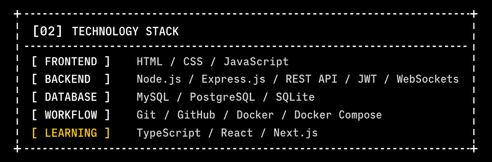
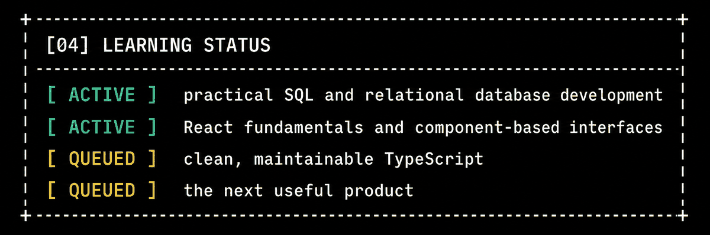

<div align="center">
  

  <br />

  
</div>

## `[00] KANAYE: OPEN PROFILE`

```text
+------------------------------------------------------------------+
| USER       kanaye / wxrmz                                       |
| ROLE       junior web developer + SQL developer                  |
| FOCUS      full-stack applications / relational databases        |
| LOOP       build -> test -> learn -> improve                     |
+------------------------------------------------------------------+
```

I turn ideas into working web products, connect interfaces to real data and
learn by shipping projects that solve practical problems.

## `[01] EXPLORE MAIN PROJECTS`

### `> 01 / CODECOLLAB`

> Collaborative browser workspace for writing, running and reviewing code.

```text
+----------------+        +----------------+        +----------------+
|  DEVELOPER A   | <----> | SOCKET.IO ROOM | <----> |  DEVELOPER B   |
+----------------+        +----------------+        +----------------+
                              |
                       +------v-------+
                       | FASTAPI/REST |
                       +------+-------+
                              |
                       +------v-------+
                       |  POSTGRESQL  |
                       +--------------+
```

`[ MONACO EDITOR ]` `[ REAL-TIME COMMENTS ]` `[ STATIC ANALYSIS ]` `[ CODE EXECUTION ]`

**STACK** &nbsp; `Next.js` `TypeScript` `FastAPI` `PostgreSQL` `SQLAlchemy` `Docker`

[](https://github.com/wxrmz/Codecollab)

---

### `> 02 / BANYAMORE`

> Responsive business website with live availability and online booking.

```text
+-----------+        +----------------+        +---------------+
|  VISITOR  | -----> | NEXT.JS WEBSITE| -----> | YCLIENTS API  |
+-----------+        +-------+--------+        +-------+-------+
                            |                         |
                  services / gallery          slots / booking
```

`[ RESPONSIVE UI ]` `[ AVAILABILITY CALENDAR ]` `[ API INTEGRATION ]` `[ ADMIN AREA ]`

**STACK** &nbsp; `Next.js` `React` `TypeScript` `Tailwind CSS` `Framer Motion` `REST API`

[](https://github.com/wxrmz/BanyaMore1)

## `[02] INSPECT TECHNOLOGY STACK`

<div align="center">
  
</div>

## `[03] VIEW ACTIVITY`

<div align="center">
  
</div>

## `[04] KEEP LEARNING`

<div align="center">
  
</div>
