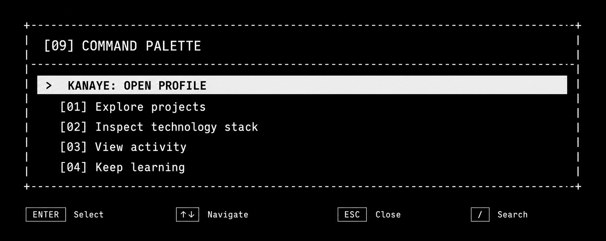

<div align="center">
  

<br />


</div>

## `> whoami`

I build full-stack applications and work with relational databases. My main
focus is turning ideas into usable products while improving through real-world
projects.

```text
location   Vladivostok, Russia
focus      web development / SQL / backend
approach   build -> test -> learn -> improve
```

## `> featured_projects`

### 01 ── [CodeCollab](https://github.com/wxrmz/Codecollab)

> A collaborative browser workspace for writing, running and reviewing code.

```text
 developer A ─────── Socket.IO room ─────── developer B
                           │
                     FastAPI / REST
                           │
                       PostgreSQL
```

`Monaco Editor` · `real-time comments` · `static analysis` · `code execution`

<sub>Next.js · TypeScript · FastAPI · PostgreSQL · SQLAlchemy · Docker</sub>

---

### 02 ── [BanyaMore](https://github.com/wxrmz/BanyaMore1)

> A responsive business website with live availability and online booking.

```text
 visitor ──> Next.js website ──> YCLIENTS API
                    │                  │
                 services        available slots
                 gallery              │
                 contacts          booking
```

`responsive UI` · `availability calendar` · `API integration` · `admin area`

<sub>Next.js · React · TypeScript · Tailwind CSS · Framer Motion · REST API</sub>

## `> stack --compact`

<div align="center">
  
</div>

| Area | Tools |
| :--- | :--- |
| **Frontend** | TypeScript, JavaScript, React, Next.js, HTML, CSS |
| **Backend** | Python, FastAPI, REST API, JWT, WebSockets |
| **Database** | SQL, PostgreSQL, SQLAlchemy ORM |
| **Workflow** | Git, GitHub, Docker, Docker Compose |

```sql
SELECT skill, progress
FROM learning
WHERE focus IN ('SQL', 'backend', 'clean TypeScript')
ORDER BY practice DESC;
```

## `> activity --live`

<div align="center">
  
  
</div>

<div align="center">
  
</div>

```text
kanaye@github:~$ git commit -m "keep building"
[main] build. break. learn. repeat.
```
